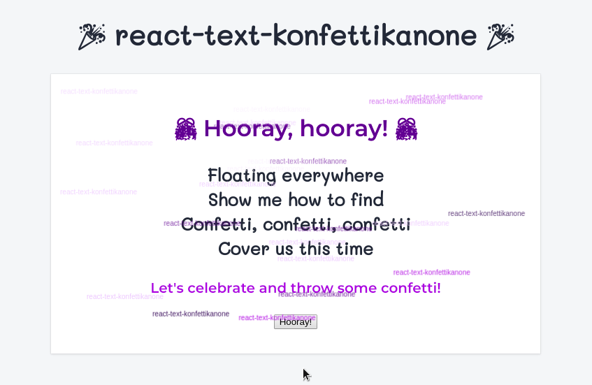

### Built on top of https://github.com/spurtli/react-konfettikanone

<div align="center">
  
</div>
<br />

`react-text-konfettikanone` is a light-weight and hardware accelerated React package that lets you celebrate with text confetti 🎉🎊
<br />

### ✨ What it looks like



<br />

### 🚀 Setup

```bash
yarn add react-text-konfettikanone
```

<br />

### 👩🏼‍💻 How to use `<Konfettikanone />`

#### `className`

Extend custom styles

#### `colors`

Array of Strings
`["#F6F0FD", "#E3D0FF", "#9C6ADE", "#50248F", "#230051"]`

### `fontSizes`

Array of String: Usable font sizes of the text

### `fontFamily`

String: Font family to use for the confetti particles

### text

String: Text to use for confetti particles

#### `particles`

Number

#### `duration`

Number

#### `launch`

Boolean

#### `onLaunchEnd`

Function

<br />

### 👷🏼‍♀️ Example

```jsx
import { Konfettikanone } from "react-text-konfettikanone";
```

```jsx
function CelebrationCard() {
  return (
    <Konfettikanone launch={this.state.launch}>
      <div>
        <h2>🎊 Hooray, hooray! 🎊</h2>
        <p>Let's celebrate and throw some confetti!</p>
      </div>
      <button type="button" onClick={() => this.setLaunched(true)}>
        Confetti!
      </button>
    </Konfettikanone>
  );
}
```

<br />

### 🎫 License

Licensed under the MIT License, Copyright © 2018 Neele Barthel.<br>
See [LICENSE](./LICENSE) for more information.
